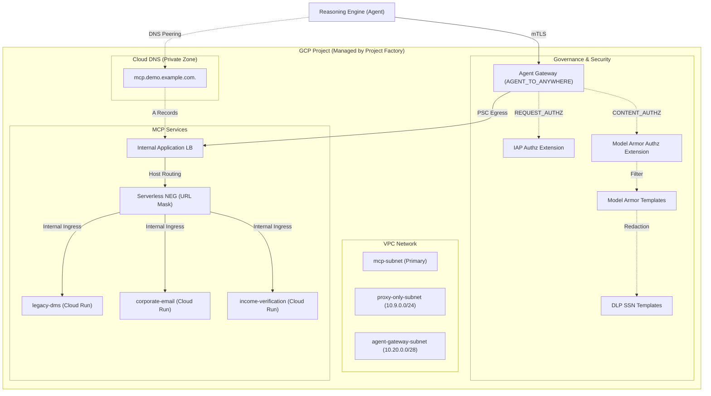

# Terraform Infrastructure for MCP Gateway

This directory contains the Terraform configuration for the MCP Gateway demo infrastructure on GCP. It is designed to bootstrap a secure, private, and governed environment for Model Context Protocol (MCP) services.

## Architecture

This infrastructure automates the deployment of a project, enabling APIs, configuring network routing, and setting up governance and security controls:



### Key Architectural Components

1. **Foundation & Project Factory**: 
   A dedicated [Google Project Factory Module](https://github.com/terraform-google-modules/terraform-google-project-factory) provisions a new, isolated project. 
   - An organization policy override for `constraints/iam.allowedPolicyMemberDomains` is automatically applied to allow Google-managed service agents (like the Service Extensions system SA) to be granted IAM roles.
   - A bootstrapping provider pattern is used: `google.project_creation` creates the project and enables APIs, while all subsequent resources are provisioned via default providers bound to the newly created, randomized project ID (`module.foundation.project_id`).

2. **Network Isolation**:
   - The three MCP services (`legacy-dms`, `corporate-email`, `income-verification`) are deployed as **Cloud Run v2** services with `ingress = INGRESS_TRAFFIC_INTERNAL_LOAD_BALANCER` — they cannot be reached from the public internet.
   - A regional **Internal Application Load Balancer** with a single **Serverless NEG using a URL mask** (`<service>.<mcp_internal_dns_zone.domain>`) fronts all three services. The LB extracts the `<service>` token from the request `Host` header and routes to the Cloud Run service of the same name.
   - A Cloud DNS **private zone** (typically `mcp.<dns_zone_domain>.`) is attached to the VPC and holds A records pointing at the LB VIP.

3. **Governance via Agent Gateway**:
   When `enable_agent_gateway = true`, an **Agent Gateway** is deployed to govern and secure the traffic:
   - **IAP Authorization Extension**: Performs identity-based authorization checks using IAP policy version `V1`.
   - **Model Armor Authorization Extension**: Inspects and sanitizes payload content.
   - **DLP Integration**: The Model Armor response template is linked to regional DLP inspect and de-identification templates to redact sensitive data (like SSNs) in transit.
   - The MCP internal LB VIP is automatically relocated into the dedicated `agent-gateway-subnet` to satisfy same-subnet requirements for Private Service Connect interfaces.

### Resource Provisioning Flow

The Terraform configuration provisions resources in a sequential, dependency-ordered pipeline:

```
┌────────────────────────────────────────────────────────┐
│ 1. Foundation                                         │  Project, APIs, Service Identities & IAM Propagation
└───────────────────────────┬────────────────────────────┘
                            │
┌───────────────────────────▼────────────────────────────┐
│ 2. Networking & Subnets                               │  VPC, Subnets, Private NAT, Private DNS Zones
└───────────────────────────┬────────────────────────────┘
                            │
┌───────────────────────────▼────────────────────────────┐
│ 3. Security & Build Infra                              │  Model Armor, Artifact Registry, Cloud Build Bucket
└───────────────────────────┬────────────────────────────┘
                            │
┌───────────────────────────▼────────────────────────────┐
│ 4. MCP Cloud Run Services                              │  Microservices (Mortgage Agent, DMS, etc.) & Runtime SAs
└───────────────────────────┬────────────────────────────┘
                            │
┌───────────────────────────▼────────────────────────────┐
│ 5. Private Load Balancer & DNS                         │  Internal Application LB, Serverless NEG & Private DNS
└───────────────────────────┬────────────────────────────┘
                            │
┌───────────────────────────▼────────────────────────────┐
│ 6. Agent Gateway (Governance Plane)                    │  Agent Gateway, PSC Interface, IAP & Model Armor Authz
└───────────────────────────┬────────────────────────────┘
                            │
┌───────────────────────────▼────────────────────────────┐
│ 7. Agent Registry Endpoints                            │  Service Registration for Google APIs & MCP Servers
└────────────────────────────────────────────────────────┘
```

1. **Foundation**: Provisions the GCP project, enables required APIs (`networkservices`, `aiplatform`, etc.), creates service identities, and enforces necessary `time_sleep` delays for global IAM propagation.
2. **Networking**: Sets up custom VPC subnets (Primary, Proxy-only, PSC Interface, and Agent Gateway co-location subnet) along with private Cloud DNS zones.
3. **Security & Build Infrastructure**: Configures Model Armor (prompt injection, jailbreak, & sensitive data protection filters), Artifact Registry Docker repositories, and Cloud Build storage buckets.
4. **MCP Cloud Run Services**: Deploys microservices with internal-only ingress rules and configures runtime service accounts.
5. **Private Load Balancer & DNS**: Configures the Internal Application Load Balancer with Serverless NEGs and private DNS A-records pointing to the ILB VIP.
6. **Agent Gateway**: Deploys the Google-managed Agent Gateway (`google_network_services_agent_gateway`), provisions the PSC-Interface Network Attachment, and attaches IAP and Model Armor authorization policies.
7. **Agent Registry Endpoints**: Registers Google API endpoints and MCP server endpoints in the Agent Registry service catalog.

---

## Prerequisites

- Terraform >= 1.12.2
- Google Cloud SDK (`gcloud`) authenticated with appropriate permissions
- A GCP Billing Account
- A GCP Folder or Organization ID

---

## Quick Start

1. **Configure Variables**:
   ```bash
   # Copy example configuration
   cp example.tfvars terraform.tfvars
   # Edit terraform.tfvars with your project details and image URIs
   ```

2. **Configure Backend (Optional)**:
   ```bash
   cp example.backend.conf backend.conf
   # Edit backend.conf with your GCS bucket details
   ```

3. **Initialize & Deploy**:
   ```bash
   terraform init -backend-config=backend.conf
   terraform apply -var-file=terraform.tfvars
   ```

4. **Verifying Internal Routing**:
   After `terraform apply`, from a VM in the VPC:
   ```bash
   # DNS resolves to the internal LB VIP
   dig +short legacy-dms.mcp.demo.example.com

   # LB routes by Host header to the matching Cloud Run service
   curl https://legacy-dms.mcp.demo.example.com/mcp
   curl https://corporate-email.mcp.demo.example.com/mcp
   curl https://income-verification.mcp.demo.example.com/mcp

   # *.run.app URLs are blocked from the public internet
   curl https://<service>-<hash>-uc.a.run.app/mcp   # 403 from outside the VPC
   ```

---

5. **Set Environment Variables**:
   Retrieve the generated project ID, region, and the user-managed Cloud Build service account email from the Terraform outputs:
   ```bash
   export PROJECT_ID=$(terraform output -raw foundation_project_id)
   export REGION=$(terraform output -raw region)
   export PROJECT_NUMBER=$(terraform output -raw foundation_project_number)
   export ORG_ID=$(terraform output -raw organization_id)
   export BUILD_SA=$(terraform output -raw cloudbuild_service_account)
   export MCP_INGRESS=all
   ```

6. **Verify Services**:
   Verify that the Agent Registry, MCP Servers, and the Agent Gateway have been successfully provisioned:
   ```bash
   # List registered services
   gcloud alpha agent-registry services list \
     --project=${PROJECT_ID} --location=${REGION} \
     --format="value(displayName,name)"

   # List registered MCP servers
   gcloud alpha agent-registry mcp-servers list \
     --project=${PROJECT_ID} --location=${REGION} \
     --format="value(displayName,name)"

   # Describe the Agent Gateway
   gcloud alpha network-services agent-gateways describe agent-gateway \
     --project=${PROJECT_ID} --location=${REGION}
   ```

7. **Update MCP Deployment Configuration**:
   Use `sed` to render the Cloud Run deployment configuration files by replacing the template variables:
   ```bash
   # Substitute in all cloudrun template files
   for f in cloudrun/*.yaml.tmpl; do
     sed -e "s/\${PROJECT_ID}/${PROJECT_ID}/g" \
         -e "s/\${REGION}/${REGION}/g" \
         -e "s/\${MCP_INGRESS}/${MCP_INGRESS}/g" \
         "$f" > "${f%.tmpl}"
   done

   # Verify variables are updated (should return no output)
   grep -E '\$\{PROJECT_ID\}|\$\{REGION\}|\$\{MCP_INGRESS\}' cloudrun/*.yaml
   ```

8. **Build and Deploy MCP Services**:
   Build the container images using Cloud Build (using the static `cloudbuild.yaml` in the root directory to specify `CLOUD_LOGGING_ONLY` and the user-managed service account, bypassing the disabled default Compute Engine SA) and deploy them to Cloud Run:
   ```bash
   # Build and push the service images using the user-managed Cloud Build service account
   gcloud builds submit src/legacy-dms \
     --config=cloudbuild.yaml \
     --substitutions=_IMAGE="${REGION}-docker.pkg.dev/${PROJECT_ID}/gateway-docker/legacy-dms:latest" \
     --service-account="projects/${PROJECT_ID}/serviceAccounts/${BUILD_SA}" \
     --project=${PROJECT_ID}

   gcloud builds submit src/corporate-email \
     --config=cloudbuild.yaml \
     --substitutions=_IMAGE="${REGION}-docker.pkg.dev/${PROJECT_ID}/gateway-docker/corporate-email:latest" \
     --service-account="projects/${PROJECT_ID}/serviceAccounts/${BUILD_SA}" \
     --project=${PROJECT_ID}

   gcloud builds submit src/income-verification-api \
     --config=cloudbuild.yaml \
     --substitutions=_IMAGE="${REGION}-docker.pkg.dev/${PROJECT_ID}/gateway-docker/income-verification-api:latest" \
     --service-account="projects/${PROJECT_ID}/serviceAccounts/${BUILD_SA}" \
     --project=${PROJECT_ID}
   ```

   # Deploy the services to Cloud Run
   gcloud run services replace cloudrun/legacy-dms.yaml \
     --project=${PROJECT_ID} --region=${REGION}

   gcloud run services replace cloudrun/corporate-email.yaml \
     --project=${PROJECT_ID} --region=${REGION}

   gcloud run services replace cloudrun/income-verification-api.yaml \
     --project=${PROJECT_ID} --region=${REGION}
   ```

9. **Grant Agent MCP Egress Permissions**:
   Run the provided helper script to authorize your Vertex AI Agents to call the private MCP services through the Agent Gateway:
   ```bash
   chmod +x scripts/grant_agent_mcp_egress.sh
   ./scripts/grant_agent_mcp_egress.sh
   ```

10. **Deploy the Vertex AI Agent**:
    Deploy the Mortgage Assistant Agent to Vertex AI Reasoning Engine using standard Python virtual environments:
    ```bash
    # Navigate to the agent directory
    cd src/mortgage-agent

    # Create and activate a virtual environment
    python3 -m venv .venv
    source .venv/bin/activate

    # Install dependencies and the local package in editable mode
    pip install --upgrade pip
    pip install google-cloud-aiplatform
    pip install -e .

    # Retrieve the invoker service account email
    export MCP_INVOKER_SA_EMAIL=$(terraform -chdir=../.. output -raw agent_mcp_invoker_email)

    # Deploy the agent
    python deploy_agent.py \
      --project=${PROJECT_ID} \
      --region=${REGION} \
      --enable-agent-identity \
      --agent-name=mortgage-agent \
      --agent-gateway=projects/${PROJECT_ID}/locations/${REGION}/agentGateways/agent-gateway \
      --mcp-invoker-sa=${MCP_INVOKER_SA_EMAIL} \
      --model-endpoint-location=global

    # Capture the AGENT_ID programmatically from the Vertex AI REST API
    export AGENT_ID=$(curl -fsS \
      -H "Authorization: Bearer \$(gcloud auth print-access-token)" \
      "https://${REGION}-aiplatform.googleapis.com/v1/projects/${PROJECT_ID}/locations/${REGION}/reasoningEngines" \
      | jq -r '.reasoningEngines[] | select(.displayName=="mortgage-agent") | .name' \
      | awk -F'/' '{print \$NF}')
    ```

---

## Clean Up & Destroy

If you want to tear down the infrastructure, you must delete the Vertex AI Reasoning Engine agent **before** running `terraform destroy`. The agent holds an active network egress connection to the Agent Gateway, which prevents the gateway from being deleted.

1. **Delete the Vertex AI Agent**:
   ```bash
   # Extract the agent ID
   export AGENT_ID=$(curl -fsS \
     -H "Authorization: Bearer \$(gcloud auth print-access-token)" \
     "https://${REGION}-aiplatform.googleapis.com/v1/projects/${PROJECT_ID}/locations/${REGION}/reasoningEngines" \
     | jq -r '.reasoningEngines[] | select(.displayName=="mortgage-agent") | .name' \
     | awk -F'/' '{print \$NF}')

    # Delete the agent
    gcloud beta ai reasoning-engines delete ${AGENT_ID} \
      --region=${REGION} --project=${PROJECT_ID}
    ```

2. **Destroy Infrastructure**:
   ```bash
   terraform destroy -var-file=terraform.tfvars
   ```


---

## Known `gcloud` Exceptions

The project convention is to manage all infrastructure via Terraform. The following exceptions use `gcloud` via `null_resource` local-exec because no native Terraform resource exists:

- **Model Armor MCP Content Security** (`modules/model-armor/main.tf`): Uses `gcloud beta services mcp content-security add` to configure MCP floor settings. There is no Terraform resource for this API as of the current provider version.


